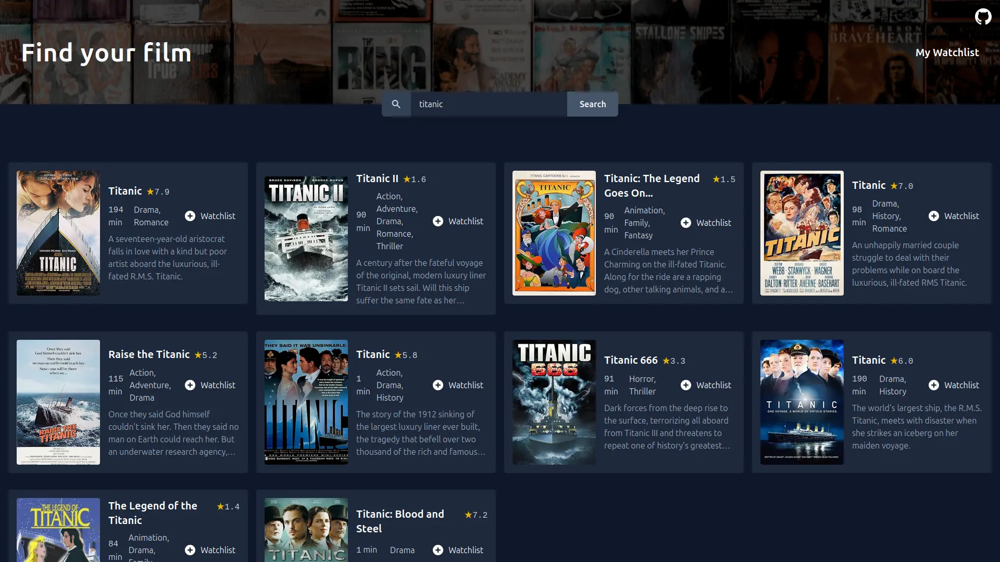

# Movie Watchlist

A simple web app to search for movies and manage your personal watchlist. Built with Vanilla JavaScript, Tailwind CSS, and the OMDB API.

This project is based on [Scrimba](https://scrimba.com/) solo project.

## Demo

[](https://movie-watchlist-omega-seven.vercel.app/)




## How this project was built

Initially, with AI(copilot or cursor) tab proposal assistance, I drafted the CSS and HTML.
Afterward, I completed this project through AI-driven development: asking questions, implementing instructions, bug checking, and code critique.
If I don't understand code suggested or generated by AI, ask the AI to explain it, and only adopt it once I'm personally satisfied with the explanation.
Every line was **reviewed, tested, and either kept with confidence or rewritten/deleted by me**  
 → The final code contains only what I'm confident in and take responsibility for

## Features

- Search for movies by title
- View movie details (poster, rating, plot, etc.)
- Add movies to your watchlist
- Remove movies from your watchlist
- Persistent storage using localStorage
- Responsive design with dark mode support
- Accessibility features (ARIA labels, keyboard navigation)

## Technologies Used

- **Frontend**: HTML, CSS (Tailwind CSS), JavaScript
- **API**: OMDB API (https://www.omdbapi.com/)
- **Deployment**: Vercel

## Getting Started

### Prerequisites

- A modern web browser
- Internet connection (for API calls)

### Installation

1. Clone the repository:

   ```bash
   git clone https://github.com/shotaro-dev/movie-watchlist.git
   cd movie-watchlist
   ```

2. Open `index.html` in your browser.

### Usage

1. Enter a movie title in the search bar or Click "Search" to fetch results.
2. Click "Watchlist" on a movie to add it to your list.
3. Navigate to "My Watchlist" to view and manage saved movies.

## API Key

This app uses the OMDB API. The free plan allows up to 1000 requests per day. For production use, consider upgrading or using your own API key.

## License

Made with ❤️ by [@shotaro-dev](https://github.com/shotaro-dev) • [MIT Licensed](LICENSE)

## Acknowledgments

- Movie data provided by [OMDB API](https://www.omdbapi.com/)
- Icons from Heroicons
- Images from [Unsplash](https://unsplash.com/) (tyson-moultrie, evan-buchholz)
